# Release process

TrustyAI follows a sprint-based release process. Each sprint is 3 weeks long and the sprint planning and dates are documented in the [*TrustyAI planning* project in GitHub](https://github.com/orgs/trustyai-explainability/projects/12).

TrustyAI follows a [semantic versioning scheme](https://semver.org/). The version number is of the form `MAJOR.MINOR.PATCH` where:

- `MAJOR` is incremented when there are breaking changes to the API or major changes in architecture
- `MINOR` is incremented when there are new features or functionality added
- `PATCH` is incremented when there are bug fixes or minor changes

The release process is as follows:

```mermaid
stateDiagram
    state "🏁 Start of Sprint" as start
    state "🚀 2 weeks: Minor Release" as minor
    state "End of Sprint" as end
    state "🚀 Patch release (before 2w)" as patchBefore
    state "🚀 Patch release (after 2w)" as patchAfter

    start --> minor: ⏳ 2 weeks
    minor --> end: ⏳ 1 week
    start --> patchBefore: Bug Fix (Before 2w)
    minor --> patchAfter: Bug Fix (After 2w)
    patchBefore --> minor: Minor Bumped (e.g., 0.3.1 to 0.4.0)
    patchAfter --> end: Patch Stays
```

- If there's a critical bug fix that needs to be released before the two week release mark, a patch release is made. The version number is incremented by one in the `PATCH` position. For example, if the previous version was `0.3.0`, the new version would be `0.3.1`.
- Two weeks after the start of the sprint, a minor release is made. The version number is incremented by one in the `MINOR` position. For example, if the previous version was `0.3.0`, the new version would be `0.4.0`. This is regardless of a patch release being made or not. In the case a patch release was made, the version number is incremented by one in the `MINOR` position. For example, if the previous version was `0.3.1`, the new version would be `0.4.0`.
- If a patch release is made after the two week release mark, the minor release is not incremented. For example, if the patch release was made for version `0.3.0`, the new version would be `0.3.1`.

Releases are made via release branches with the following naming convention: `release/vMAJOR.MINOR.PATCH`. For example, the release branch for version `0.3.0` would be `release/v0.3.0` and for version `0.3.1` would be `release/v0.3.1`.