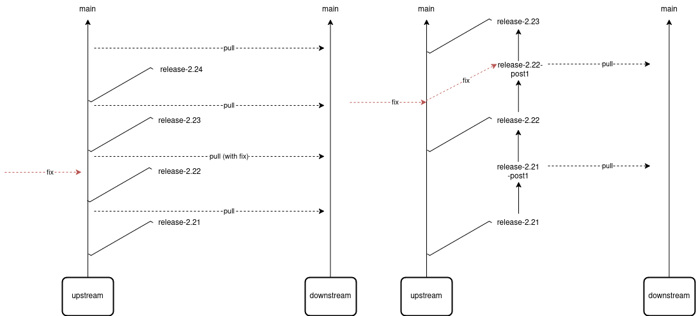

## Title

Branching Strategy

## Context and Problem Statement

Currently, we maintain a dedicated `release-x` branch for each community release, so that community users can receive releases periodically. However, our downstream consumers rely on the `main` branch for ongoing development and require specific updates. However, this might include commits in `main` which are not yet fully ready either for community releases or downstream.

## Goals

To enables us to provide downstream consumers with updates/fixes in stable branch, without disrupting the upstream development/release cycle on `main`.

## Non-goals

N/A

## Current situation

See [Context](#context-and-problem-statement).

## Proposal

I propose creating an `release-x-post1` branch that:
1. Builds on the most recent community release (`release-x`) by incorporating selected changes and fixes that downstream consumers need.
2. Remains stable for downstream use, while allowing `main` development to continue at a normal pace.
3. Close the gap between major community releases, by allowing downstream consumers to get fixes and updates without having to wait for community official `release-(x+1)` releases.

## Threat model

N/A

## Alternatives Considered / Rejected

N/A

## Challenges

Automation must be put in place to create `x-post1` branches simultaneously to `x`.

## Dependencies

N/A

## Consequences if not completed

Downstream consumers might get unwanted commits from `main`.