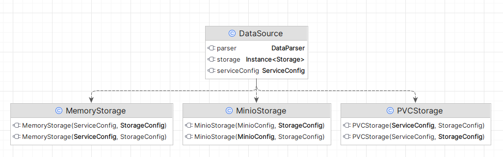

## Title

Persistence Layer Requirements for `trustyai-service`

## Context and Problem Statement

In order to generate explanations and calculate metrics, the `trustyai-service` requires access to (i) single predictions to be explained and (ii) batches of predictions to perform metrics' calculations.

The current design and implementation of the persistence layer only makes it possible for directly reading and writing of binaries to a (pluggable) storage. While this enables usage of different storage options (e.g., PVC, MinIO, etc.), it has the limitation of requiring `trustyai-service` to reimplement everything else a persistence layer requires from scratch (e.g., concurrent writes, efficient data retrieval, etc.) 

As the `trustyai-service` aims to be used with multiple models served by different serving runtimes concurrently, the persistence layer would rather use a proper database solution for managing predictions consistently in a concurrent scenario.

## Goals

Make the `trustyai-service` able to read and write data about predictions coming from `ModelMesh`, `Kserve`, etc. with high concurrency, low memory footprint, avoiding any data loss. 

## Non-goals

Stick to a specific persistence layer implementation. While, for example, a database is likely to be a good candidate solution for this ADR's goal, other options can be considered as well.

## Current situation

In the current `trustyai-service` architecture, the persistence and retrieval of such predictions is managed by the service itself (e.g. there's not a "prediction provider" service) by accessing a `org.kie.trustyai.service.data.DataSource` interface.
Via a `DataSource` it is possible to:
* retrieve a `org.kie.trustyai.explainability.model.Dataframe` (similar to python's `pandas.DataFrame`) given the _id_ of a served model (and, optionally, a _batch_ size). The returned `Dataframe` contains one or more predictions (`org.kie.trustyai.explainability.model.Prediction`).
* persist a set of predictions (e.g., a `Dataframe`) for a given model _id_.

The `DataSource` relies on a `org.kie.trustyai.service.data.storage.Storage` to access persisted data (both for reading and writing). Currently `trustyai-service` supports the following `Storage` implementations:
* `PVCStorage`: to suppprt Kubernetes' [PersistentVolumeClaim](https://kubernetes.io/docs/concepts/storage/persistent-volumes/), making it possible to leverage a file based storage "in the cloud".
* `MinioStorage`: to support [MinIO](https://min.io/) object storage.
* `MemoryStorage`: for in-memory support, mainly useful for dev/testing purposes.

Such pluggable storage design is good for avoiding dependencies between the business logic (read/write predictions) and where the data is actually persisted.

One big limitation of the current design is that it was implemented with a file-based storage in mind, e.g., read / write `Dataframes` in _CSV_ files. While this was good for an initial and single-tenant version of the `trustyai-service`, it brings some concerns with respect to concurrency, data consistency and performance.

Practically, a few issues can be already identified:
1. data loss might occur if/when two different threads send predictions for the same model via `org.kie.trustyai.service.data.utils.InferencePayloadReconciler#save`; that in fact triggers `DataSource#saveDataframe` which has first to check whether binary data for that specific model exists in the `Storage` or not and, based on that, decide whether creating that same binary or append to it.
2. predictions for a given model are all stored in a single binary files (e.g., CSV files) within `PVC` (the default, but the same goes for `MinIO`) and therefore it is not possible to "select" a specific prediction by any filtering mechanism (e.g., by id, feature value, etc.), requiring the `trustyai-service` to load all the existing predictions for a single model whenever even just one it is needed.

Having a service/solution that already allows for reading and writing structured data (e.g. a database) would allow us to avoid any concurrency issues when writing (e.g. "ghost updates"), retrieve only the appropriate data by using "filters". In general will require the `trustyai-service` not to re-implement tricky data management algorithms and services and focus on extending and enhancing its capabilities.

## Proposal

Make changes to the `DataSource` implementation such that it can (also?) delegate read/write operations to a persistence layer solution that provides allows concurrent read/writes, ACID transactions, etc.

### Threat model

N/A

## Alternatives Considered / Rejected

N/A

## Challenges

Identify/implement a persistence storage solution that works well both in a plain local as well as in a full distributed/cloud based scenario.

## Dependencies

## Consequences if not completed

When fetching data from `Storage` implementations will always load the entire set of persisted predictions into main memory; most of the time this is not necessary and actually suboptimal, especially in the case the service needs to explain a single prediction among all the retrieved ones.

Possible data loss because of "ghost updates" when multiple serving instances send their data / predictions to the `trustyai-service` at the same time.