## Context and Problem Statement

TrustyAI maintains several components in multiple GitHub repositories:

1. **Upstream** (https://github.com/trustyai-explainability):
    - [TrustyAI operator](https://github.com/trustyai-explainability/trustyai-service-operator)
    - [TrustyAI service](https://github.com/trustyai-explainability/trustyai-explainability)
    - [Guardrails orchestrator](https://github.com/trustyai-explainability/fms-guardrails-orchestrator)
    - [Guardrails detectors](https://github.com/trustyai-explainability/guardrails-regex-detector)
    - [HF Detector Runtime](https://github.com/trustyai-explainability/guardrails-detectors)
    - [Python TrustyAI](https://github.com/trustyai-explainability/trustyai-explainability-python)
    - Llama Stack out-of-tree providers
        - [LMEval](https://github.com/trustyai-explainability/llama-stack-provider-lmeval)
        - [Guardrails](https://github.com/trustyai-explainability/llama-stack-provider-trustyai-fms)

2. **Midstream** (https://github.com/opendatahub-io) - forks of upstream repositories

3. **Downstream** - forks of midstream repositories

The current development process presents several challenges:
- Manual handling of code propagation between repositories
- Complex development cycles
- Difficulty controlling which features propagate downstream
- Maintaining reference copies of upstream code
- Allowing experimentation without breaking downstream
- Minimising the number of branches in use

## Goals

- Streamline Git workflow across upstream, midstream, and downstream repositories
- Minimise the number of branches in use
- Simplify development cycles
- Ensure all development and experimentation happens upstream only
- Support incubation and testing of upstream features in ODH before downstream release
- Provide precise control over feature propagation to downstream
- Automate container image building and `params.env` updates

## Non-goals

- Creating completely separate development paths for each repository
- Maintaining multiple parallel long-term feature branches
- Fully automating all aspects of the development workflow without human oversight
- Developing or experimenting with features in midstream (ODH) repositories

## Current situation

The project currently lacks a standardised workflow across repositories, resulting in manual code propagation, complex development cycles, and difficulty controlling feature propagation downstream.

## Proposal

We will implement a streamlined Git workflow with the following structure:

### Repository Structure
- **Upstream**: Single persistent branch: `main` - Used for all development and experimentation
- **Midstream**: Three persistent branches:
    - `main` - Complete mirror of **upstream:main**
    - `incubation` - Branch for ODH feature testing, validation, and releases (no development)
    - `stable` - Curated set of validated features for downstream consumption
- **Downstream**: Single persistent branch: `main` - Syncs from **midstream:stable**
- Temporary feature branches: created via PRs and deleted after merge
- Release branches: created from **midstream:incubation** for ODH releases (_e.g._, **odh/2.20**, **odh/2.21**)

### Release Cycle

The project components will follow these release cadences:
- **Upstream**: Releases every 3 weeks
- **Midstream (ODH)**: Releases every 3 weeks, coinciding with upstream releases
- **Downstream**: Release schedule determined by downstream teams (typically monthly, but not fixed)

This schedule allows upstream features to be developed, tested in ODH, and then propagated to downstream after a period of incubation. Downstream teams maintain flexibility in their release timing to accommodate their specific requirements and validation processes.

### Branch Flow


### Commit Lifecycle Diagrams

The following diagrams illustrate the specific lifecycle of commits through the system:

> **Legend**:
> - 🤖 Automated process
> - 👤 Manual/human process

#### Upstream Feature → Incubation → Stable → Downstream

```mermaid
sequenceDiagram
    participant U as Upstream:main
    participant MM as Midstream:main
    participant MI as Midstream:incubation
    participant MOB as Midstream:odh/x.y
    participant MS as Midstream:stable
    participant D as Downstream:main

    Note over U: Feature development
    U->>U: 👤 Feature commit merged
    Note over U,MM: Daily automated sync
    U->>MM: 🤖 Feature synced to midstream:main
    Note over MM,MI: Feature testing
    MM->>MI: 👤 Feature promoted to incubation
    Note over MI,MOB: Semi-production testing
    MI->>MOB: 🤖 Cut release branch odh/x.y for testing
    Note over MOB: Tag & Build
    MOB->>MOB: 🤖 Tag v*-odh, build images for ODH
    Note over MI,MS: Validated feature
    MI->>MS: 👤 Cherry-pick validated features to stable
    Note over MS,D: Downstream propagation
    MS->>D: 🤖 Automated sync to downstream
    D->>D: 🤖 Downstream release
```



#### Feature Incubation Process

```mermaid
sequenceDiagram
    participant U as Upstream:main
    participant MM as Midstream:main
    participant MI as Midstream:incubation
    participant MOB as Midstream:odh/x.y
    participant MS as Midstream:stable

    Note over U,MM: Features arrive from upstream
    U->>MM: 🤖 Daily sync brings in new features
    Note over MM,MI: Feature incubation
    MM->>MI: 👤 Select features moved to incubation
    MI->>MI: 👤+🤖 Integration testing with other features
    Note over MI,MOB: Semi-production validation
    MI->>MOB: 🤖 Cut release branch for ODH testing
    MOB->>MOB: 🤖 Build images for ODH deployment
    MOB->>MOB: 👤+🤖 Test in semi-production environments
    Note over MI,MS: Feature curation
    MI->>MS: 👤 Validated features promoted to stable
    Note over MI: Feature validation cycle
    MI->>MI: 👤 Some features may require more testing
    MI->>MS: 👤 Later promotion when validated
```



#### Critical Security Fix Path

```mermaid
sequenceDiagram
    participant U as Upstream:main
    participant MM as Midstream:main
    participant MI as Midstream:incubation
    participant MOB as Midstream:odh/x.y (active)
    participant MS as Midstream:stable
    participant D as Downstream:main

    Note over U: Security vulnerability discovered
    U->>U: 👤 Security fix committed
    Note over U,MM: Expedited sync
    U->>MM: 🤖/👤 Security fix synced (automated or manual)
    Note over MM: Critical path processing
    MM->>MI: 👤 Fix applied to incubation
    MM->>MS: 👤 Fix applied directly to stable
    MI->>MOB: 👤 Fix backported to active ODH releases
    Note over MOB: Quick release
    MOB->>MOB: 🤖 New patch releases tagged
    Note over MS,D: Downstream update
    MS->>D: 🤖 Security fix propagated to downstream
    D->>D: 🤖 Fix release if needed
```



### Key Processes

1. **Upstream Development**:
    - 👤+🤖 All development and experimentation happens in `main`
    - 👤 Short-lived PR branches only (deleted after merge)
    - 🤖 Community releases via tags on `main` with `-community` suffix
    - 🤖 E2E testing for each PR to `main`
    - 🤖 Dependabot enabled to automate dependency updates
    - 🤖 Trivy security scanning for each PR (High or Critical CVEs block merge)
    - **Main Branch Stability**: While `main` is used for experimental features and innovation, it should be kept as stable as possible:
        - ✅ Features not yet on the roadmap or experimental features are acceptable
        - ❌ Broken commits that prevent the software from running are not acceptable
        - 👤 All PRs must ensure the component can still build and start correctly
        - 🤖 All PRs must pass CI checks and 👤 code reviews before merging
    - **Feature Flagging**: Whenever possible, new features should be implemented with feature flags to allow:
        - Disabling of unstable features in production environments
        - A/B testing of features
        - Gradual rollout of new capabilities

2. **Midstream Development and Synchronisation**:
    - 🤖 **Automated Daily Sync**: Upstream:main → Midstream:main
    - 👤 **Feature Incubation**: Testing and validation of upstream features in `incubation` branch
    - 🤖 **ODH Releases**: Regular release branches (_e.g._, **odh/2.20**, **odh/2.21**) cut from `incubation` for ODH deployment
    - 👤 **Feature Curation**: Cherry-pick validated features from `incubation` to `stable`
    - 🤖 **Incubation Branch Testing**: Comprehensive testing for ODH releases
    - 🤖 **Stable Branch Testing**: E2E CI for each PR to `stable`
    - 👤 **Bug Fix Process**: Any bugs found during ODH testing must be fixed upstream, not in midstream

3. **Downstream Integration**:
    - 🤖 **Automated Sync**: Midstream:stable → Downstream:main
    - 👤+🤖 **Release processes** determined by downstream teams

4. **Container Image Management**:
    - 🤖 TrustyAI operator maintains multiple params.env files:
        - 👤+🤖 Base: Points to upstream `latest` images
        - 👤+🤖 ODH overlay: Points to midstream versioned images from `odh/*` releases
        - 👤+🤖 Downstream overlay: Points to downstream versioned images

### Testing Strategy

1. **Upstream**:
    - Unit/Lint/Integration tests for each PR
    - Developer-centred testing
    - E2E tests for integrated components
    - Security scanning with Trivy to identify vulnerabilities
    - Automated dependency updates via Dependabot
    - **All development and experimentation happens here**
    - **Focus on individual component testing rather than cross-component integration**

2. **Midstream:main**:
    - Automated smoke tests when syncing with upstream
    - Ensures basic functionality is preserved

3. **Midstream:incubation**:
    - Focus on testing and validation (not development)
    - Comprehensive testing for ODH releases
    - Identifies bugs to be fixed upstream
    - **Primary focus on integration testing between components in the ODH context**
    - **Validates that components work together as a cohesive system**

4. **Midstream:stable**:
    - Validation tests for features promoted to downstream
    - Focuses on downstream compatibility

5. **Downstream**:
    - Validation and certification tests
    - Focuses on deployment scenarios

### Access Control

1. **Upstream Repositories**:
    - Only core developers and designated review groups have merge permissions
    - External contributors can submit PRs but cannot merge
    - All PRs require approval from at least one core team member
    - **Teams**:
        - `trustyai-maintainers`: Full write access, can merge PRs, create branches
        - `trustyai-reviewers`: Can approve PRs but cannot merge directly
        - `trustyai-contributors`: Read access, can submit PRs

2. **Midstream Repositories**:
    - Core team members can perform cherry-picks from incubation to stable
    - Core team members can manually create release branches for ODH
    - Automated processes (GitHub Actions) for daily syncs and builds
    - **Teams**:
        - `odh-trustyai-maintainers`: Can cherry-pick to stable, create release branches
        - `odh-release-managers`: Can trigger ODH release processes
        - `odh-automation`: Service accounts for automated workflows

3. **Downstream Repositories**:
    - Access control determined by downstream teams
    - **Teams**:
        - Defined by downstream organisations according to their governance model

### Issue and Ticket Management

1. **Upstream**:
    - GitHub Issues and Projects used for all development work
    - Located in the upstream organisation
    - All feature requests, bug reports, and enhancements tracked here

2. **Midstream**:
    - GitHub Projects used to track cherry-pick PRs
    - Enables visualisation of what features are selected per release
    - Bugs found during ODH testing must be fixed upstream, with tickets created in upstream repositories

3. **Downstream**:
    - Issue tracking managed by downstream teams according to their processes

### Threat model

Not applicable for this workflow ADR.

## Alternatives Considered / Rejected

1. **Feature Branch Model**: Using long-lived feature branches in upstream for experimentation
    - *Rejected*: Creates too many branches and complicates merges

2. **Direct Sync from Upstream to Downstream**: Bypassing midstream entirely
    - *Rejected*: Removes ability to curate and control feature flow

3. **Multiple Stable Branches**: Having multiple stable branches for different downstream consumers
    - *Rejected*: Increases complexity without clear benefits

4. **Manual Syncing**: Relying on manual processes for synchronisation
    - *Rejected*: Prone to human error and inconsistency

5. **No Incubation Branch**: Developing ODH features directly on **midstream:main**
    - *Rejected*: Risks instability for ODH releases and complicates selective feature promotion

## Challenges

- **Requires diligent cherry-picking of features from incubation to stable**
- Needs robust automation for sync processes
- Teams must adapt to new workflows
- Potential divergence between incubation and stable branches if not managed carefully

## Dependencies

The implementation of this workflow requires:

1. Setting up automated GitHub Actions workflows for repository synchronisation
2. Establishing CI/CD pipelines for testing at each stage
3. Training teams on the new workflow process
4. Implementing Dependabot and Trivy security scanning (mostly done)
5. Creating documentation for the workflow

## Consequences if not completed

If this workflow is not implemented:
- Continued manual handling of code propagation between repositories
- Ongoing complexity in development cycles
- Continued difficulty controlling which features propagate downstream
- Challenges in maintaining reference copies of upstream code
- Limited ability to experiment without breaking downstream
- Multiplication of branches across repositories

## Implementation Details

### Automation Implementation

1. **Upstream E2E Testing Workflow**:

   A GitHub Actions workflow that automatically tests pull requests to the upstream repositories' main branch. The workflow assumes that all components already have their latest images available at `quay.io/trustyai/<component>:latest`. These `:latest` images are kept current because a new image is automatically built and tagged as `:latest` whenever a PR is merged to the main branch. For each PR:

    - Builds a new image only for the specific component being modified in the PR
    - Checks out the operator repository
    - Updates the `params.env` file to use the PR-specific image for only the component being tested
    - Keeps all other component references in `params.env` pointing to their `:latest` images
    - Deploys all components to the test environment
    - Runs E2E tests to verify functionality

   ```mermaid
   sequenceDiagram
       participant Dev as Developer 👤
       participant PR as Pull Request
       participant GH as GitHub Actions 🤖
       participant Quay as Quay.io Registry
       participant Op as Operator Repo
       participant K8s as Test Cluster
       participant Tests as E2E Tests

       Dev->>PR: 👤 Create/Update PR for component X
       GH->>GH: 🤖 Checkout PR code
       GH->>Quay: 🤖 Build & push image for component X
       Note right of Quay: quay.io/trustyai/X:PR-123
       GH->>Op: 🤖 Checkout operator repo
       GH->>Op: 🤖 Update params.env for component X only
       Note right of Op: Other components stay on :latest
       GH->>K8s: 🤖 Deploy operator with updated params
       GH->>K8s: 🤖 Deploy all components
       GH->>Tests: 🤖 Run E2E tests
       Tests->>GH: 🤖 Report results
       GH->>PR: 🤖 Update status
       Dev->>PR: 👤 Review results and merge if tests pass
   ```

   **Concrete Example: Orchestrator PR Testing**

   For a PR on the guardrails orchestrator component:

    1. 👤 Developer creates PR #42 to the upstream orchestrator repository
    2. 🤖 GitHub Actions triggers the E2E workflow automatically
    3. 🤖 Workflow builds `quay.io/trustyai/fms-guardrails-orchestrator:PR-42`
    4. 🤖 Workflow checks out the operator repository
    5. 🤖 Workflow updates only the orchestrator image in `params.env`:
       ```diff
       # params.env
       TRUSTYAI_SERVICE_IMAGE=quay.io/trustyai/service:latest
       - TRUSTYAI_ORCHESTRATOR_IMAGE=quay.io/trustyai/fms-guardrails-orchestrator:latest
       + TRUSTYAI_ORCHESTRATOR_IMAGE=quay.io/trustyai/fms-guardrails-orchestrator:PR-42
       TRUSTYAI_DETECTOR_IMAGE=quay.io/trustyai/detector:latest
       TRUSTYAI_RUNTIME_IMAGE=quay.io/trustyai/runtime:latest
       ```
    6. 🤖 Workflow deploys the operator and all components to test cluster
    7. 🤖 Workflow runs E2E tests against the deployment
    8. 🤖 Test results are reported back to the PR
    9. 👤 Developers review the results and merge if tests pass

2. **Daily Sync from Upstream to Midstream Main**:

   A GitHub Actions workflow that runs on a schedule to sync changes from **upstream:main** to **midstream:main**. The workflow:

    - Runs daily at a pre-determined time
    - Checks out the midstream repository
    - Adds the upstream repository as a remote
    - Fetches from upstream
    - Merges upstream/main into midstream/main
    - Runs basic validation tests
    - Pushes to midstream main
    - Notifies the team if sync fails (_e.g._, via Slack)

   ```mermaid
   sequenceDiagram
       participant U as Upstream:main
       participant GH as GitHub Actions 🤖
       participant M as Midstream:main
       participant N as Notifications
       participant Team as Team Members 👤

       Note over GH: 🤖 Daily trigger
       GH->>M: 🤖 Checkout midstream
       GH->>GH: 🤖 Add upstream remote
       GH->>U: 🤖 Fetch changes
       GH->>GH: 🤖 Merge upstream/main
       GH->>GH: 🤖 Run validation tests
       GH->>M: 🤖 Push changes

       alt Sync Failed
           GH->>N: 🤖 Create issue for team
           N->>Team: 👤 Team reviews sync failure
           Team->>M: 👤 Manual intervention if needed
       end
   ```

3. **ODH Release Creation Workflow**:

   A manually triggered GitHub Actions workflow that creates ODH release branches from the incubation branch. The workflow:

    - Accepts the release version input (e.g., 2.20, 2.21)
    - Checks out the incubation branch
    - Creates a new branch named `odh/[version]`
    - Tags the branch with `v[version]-odh`
    - Triggers image builds for the release

   ```mermaid
   sequenceDiagram
       participant U as User 👤
       participant GH as GitHub Actions 🤖
       participant I as Midstream:incubation
       participant R as Midstream:odh/x.y
       participant B as Image Build
       participant Q as Quay.io Registry

       U->>GH: 👤 Manual trigger with version
       GH->>I: 🤖 Checkout incubation
       GH->>R: 🤖 Create branch odh/x.y
       GH->>R: 🤖 Create tag v*-odh
       GH->>B: 🤖 Trigger image build workflow
       B->>B: 🤖 Build component images
       B->>Q: 🤖 Push versioned images to registry
       GH->>U: 🤖 Notify release completion
       U->>U: 👤 Verify release artifacts
   ```

4. **Midstream Stable to Downstream Sync**:
   Downstream repositories implement their own automated processes to regularly pull from **midstream:stable**. This automation ensures downstream stays current with the approved, stable features while maintaining their independence in determining the exact timing and validation procedures.

5. **Dependabot Configuration**:
```yaml
# .github/dependabot.yml
version: 2
updates:
  # Maintain dependencies for GitHub Actions
  - package-ecosystem: "github-actions"
    directory: "/"
    schedule:
      interval: "weekly"

  - package-ecosystem: "gomod" # or "maven", "gomod", etc.
    directory: "/"
    schedule:
      interval: "weekly"
    # Set custom labels
    labels:
      - "dependencies"
    # Define security updates behaviour
    open-pull-requests-limit: 10
    # Group updates when possible
    groups:
      minor-patch-dependencies:
        update-types:
          - "minor"
          - "patch"
```

6. **Trivy Security Scanning**:
```yaml
name: Trivy Security Scan

on:
  pull_request:
    branches: [main, incubation, stable]
  push:
    branches: [main, incubation, stable]

jobs:
  scan:
    name: Vulnerability Scan
    runs-on: ubuntu-latest
    steps:
      - name: Checkout code
        uses: actions/checkout@v3

      - name: Build image
        run: |
          docker build -t trustyai-component:${{ github.sha }} .

      - name: Run Trivy vulnerability scanner
        uses: aquasecurity/trivy-action@master
        with:
          image-ref: 'trustyai-component:${{ github.sha }}'
          format: 'sarif'
          output: 'trivy-results.sarif'
          severity: 'CRITICAL,HIGH'
          exit-code: '1'  # Fail the build if HIGH or CRITICAL vulnerabilities are found

      - name: Upload Trivy scan results to GitHub Security tab
        uses: github/codeql-action/upload-sarif@v2
        if: always()  # Always run this step to upload scan results even if previous step fails
        with:
          sarif_file: 'trivy-results.sarif'
```

## Example Development Flow

The following git graph illustrates a typical development flow across repositories:


This diagram shows:
1. Feature development in upstream through short-lived feature branches
2. Automated dependency updates via Dependabot in upstream
3. Daily sync from upstream:main to midstream:main
4. Testing and validation of upstream features in midstream:incubation (no development)
5. Regular ODH release branches (_e.g._, **odh/2.20**, **odh/2.21**) cut from incubation
6. Selective cherry-picking of validated features from incubation to stable
7. Automated sync from **midstream:stable** to **downstream:main**
8. Downstream release processes with customisations
